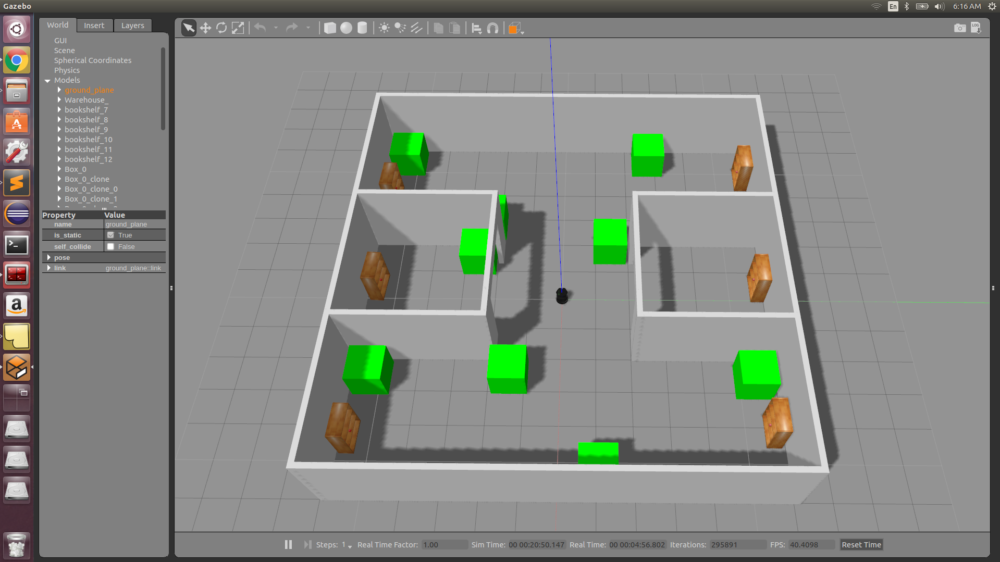
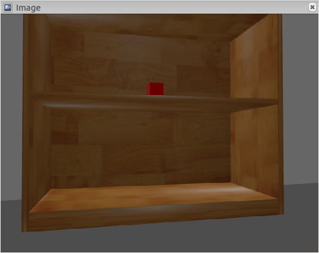

<h1 align="center"> TerpBotics: Enigma
</h1>
ENPM808X-Final Project

[](https://travis-ci.org/sandeep-kota/terpbotics_enigma)
[](https://coveralls.io/github/sandeep-kota/terpbotics_enigma?branch=week_3)
[](https://opensource.org/licenses/BSD-3-Clause)
---

Enigma is a simulation of a material handling robot that is capable of transporting packages from a pickup spot to a drop-off location within confined environments. In general, robots are a great alternative to perform labor-intensive tasks like material handling, especially in places like warehouses and industrial environments where large amounts of goods are required to be moved from one station to another. Other potential use cases of such automated systems could be in the handling of materials in places like hospitals or personal spaces. The current simulation is run using a TurtleBot robot, but it can be extended to any differential drive mobile robot catering to the payload requirements. This project is expected to be delivered to Acme Robotics within a timeframe of three weeks.


## Team Members

- Sandeep Kota Sai Pavan - [Github Link](https://github.com/sandeep-kota)
- Satyarth Praveen - [Github Link](https://github.com/satyarth934)

## Personnel

 - Sandeep Kota Sai Pavan (Email: skotasai@umd.edu, LinkedIn: [Link](https://www.linkedin.com/in/sandeepkota341997/)): A graduate student of Masters in Engineering - Robotics at University of Maryland, College Park. I'm a robotics enthusiast interested in software development for perception applications in autonomous vehicles.

  - Satyarth Praveen (Email: satyarth@umd.edu, LinkedIn: [Link](https://www.linkedin.com/in/satyarth934/)): I am currently a Robotics graduate student and a Graduate Teaching Assistant with the Department of Mathematics at the University of Maryland College Park. I was previously employed at Hi-Tech Robotic Systemz where I was involved with the perception group of the Unmanned Ground Vehicles (autonomous vehicles). I find my interest in Artificial Intelligence.

## Development using Agile Iterative Process (AIP) and Test-Driven Development

An agile iterative process (AIP) is followed for the development of this project where the product backlog is developed first. Based on the priority of the tasks, the sprint cycles and tasks are decided. A daily meeting at the beggining of the sprint cycle is conducted to decide on the daily tasks for each developer. The project backlog consists of the estimated time of completion which is alloted for each task. The actual time of completion is altered based on the progress of the project and the remaining tasks.

After planning the product backlog, UML flow diagram and UML class diagram for the software are created. A set of unit tests are used to verify the performance on a wide range of exple scenarios. Stub implementations are written with the functions to ensure that the code coverage of the software is maintained.

The link for the product backlog, time log, error log and release log can be found here - [link](https://docs.google.com/spreadsheets/d/1_W5MeEY2wuFKOgrL02KUvVZgGzwXJrWAY3AVcIMq8zY/edit#gid=241005242) 

The link for the sprint review document can be found here - [link](https://docs.google.com/document/d/1372jK7DAAn1wwATMmXONC1Ds_ZeT41WqeLHxTDLHxzQ/edit?usp=sharing)

The link for the presentation for the final project presentation is - [link](https://docs.google.com/presentation/d/1AcX80SA0h2jXYvXMIJos0L63M6Ya1XcCkGXFJuR2B6w/edit?usp=sharing) 

Thi link for the video of the simulation is - [Link](https://www.youtube.com/watch?v=weTAFZW-aLw&feature=youtu.be)


## Project Overview

This project is a simulation of a material handling robot in a gazebo environment of a warehouse. A simulated warehouse environment is designed using the gazebo environment builder, where six bookshelves simulate the different material handling stations of a warehouse and with small red boxes as the objects to be manipulated accross the different stations. 

## Application

Warehouse management is an important task in any large scale industry and an efficient automation technique for the material handling tasks can produce immense profits in the operations in companies. This simulation module can be used for analyzing the efficiency of the material handling software and simulate the operations on a given environemnt.    


## Project Output Pipeline

The following are the major tasks that were done for performming this simulation. 
1) <b> Modeling the Gazebo World </b>:
	A gazebo environment of a simulated warehouse world is made with a total of six pick-up and drop-off stations.The image of the gazebo warehouse world is shown below.
		<p align = "center"> 
			
		</p>
	The small red boxes placed in the middle row of each bookshelves are cosidered to be the objects to be picked up and placed in the different stations. An image of the red box placed in its shelf as seen from the turtlebot is given below.
		<p align = "center"> 
			
		</p>

2) <b> Mapping the Gazebo World </b>:
	After the gazebo world has been modeled, it is required to generate a map of the gazebo environment for running localization and the material handling nodes. Below is the screenshot of the mapping being performed by the robot. The robot exploration algorithm is given by the enigma walker class, where it avoids the obstacles in the environment and runs gmapping package on the gazebo world to generate the occupancy grid of the gazebo world.
		<p align ="center">
			
		</p>

3) <b> Take inputs from the user and perform navigation: </b>
	The navigation code is then run taking the user inputs on the pick location and the place location of the object. It finds the optimum path between pick location and place location and moves the robot along the path.
		<p align ="center">
			
		</p>


## Dependencies 

 - Ubuntu 16.04
 - ROS Kinetic
 - GoogleTest
 - Turtlebot
 - Gazebo 6+
 - RViz


## Installation Instructions

1) To install ros kinetic distro, follow the link in the official website - [Link](http://wiki.ros.org/kinetic/Installation)

2) Install gazebo and rviz for simulation and visualization. Follow the tutorial given in the official link. [Gazebo Installation](http://gazebosim.org/tutorials?tut=install_ubuntu&cat=install)

3) To build this simulation module into your system, run the following commands.

```
mkdir ~/catkin_ws
cd ~/catkin_ws
mkdir ~/catkin_ws/src
catkin_make
git clone https://github.com/sandeep-kota/terpbotics_enigma.git
cd ~/catkin_ws
source devel/setup.bash
```
4) To launch the program of the robot 
```
roslaunch terpbotics_enigma walker.launch
 ```
5) Run the following commands to perform navigation using amcl.
```
# Terminal one
roslaunch turtlebot_navigation amcl_demo.launch

# Terminal two
rosrun move_base move_base
```

## License

This software is released under the [BSD 3-Clause license](./LICENSE). 
